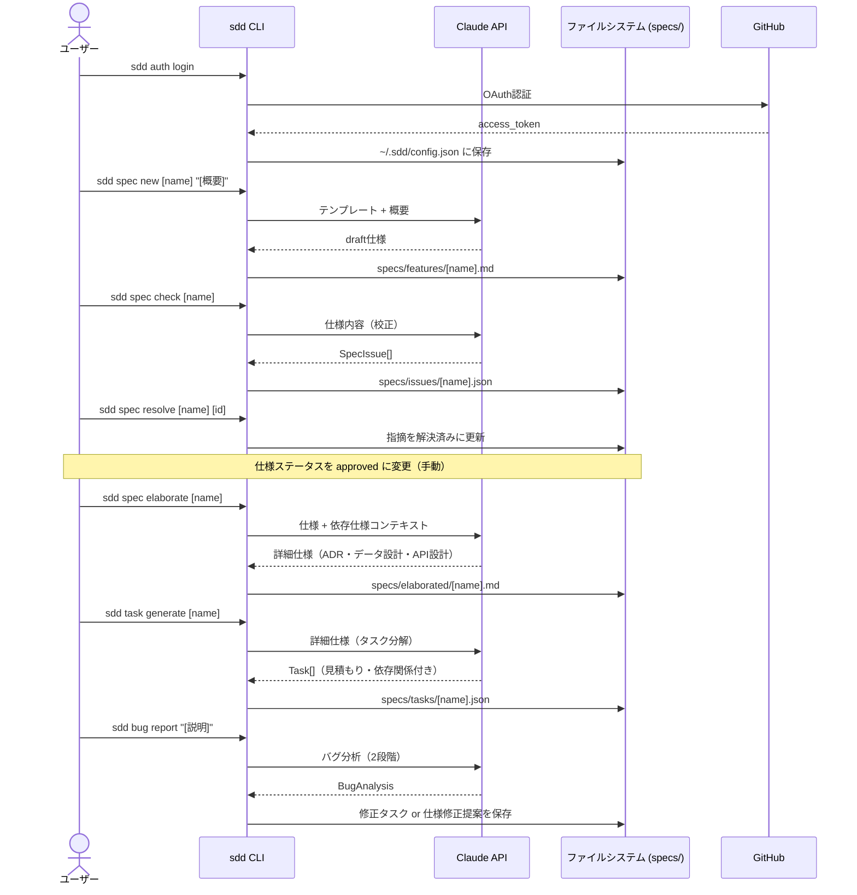
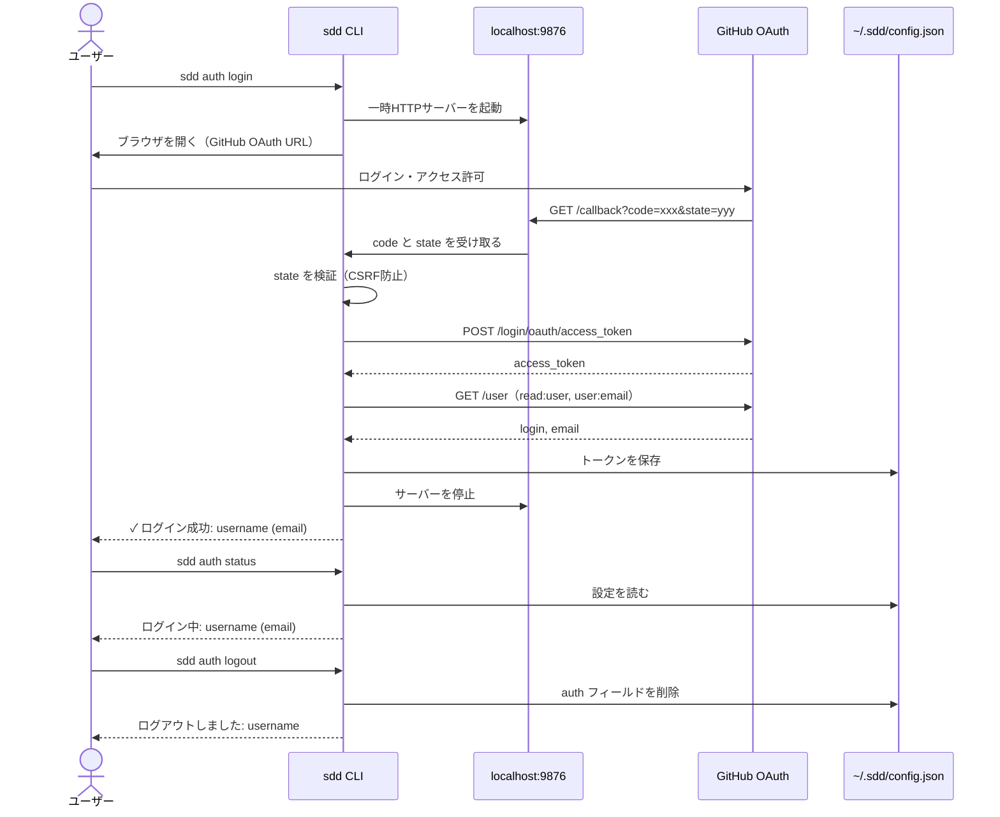
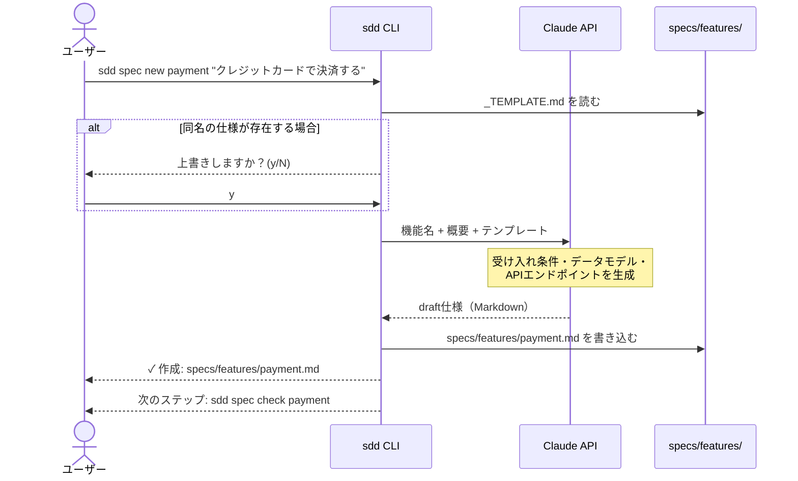
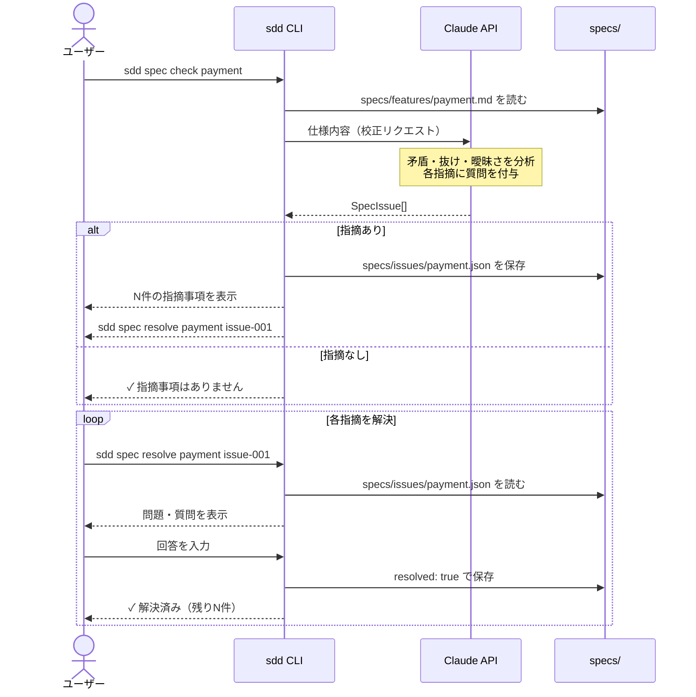
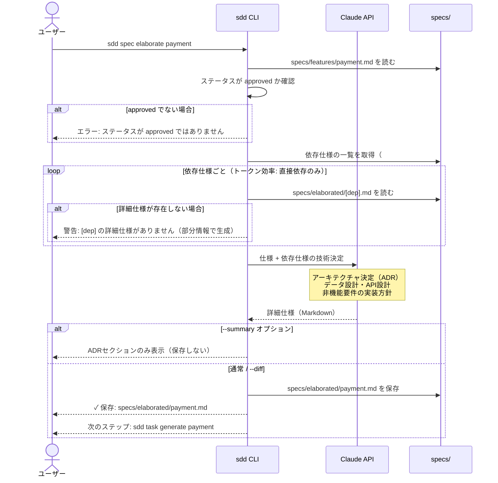
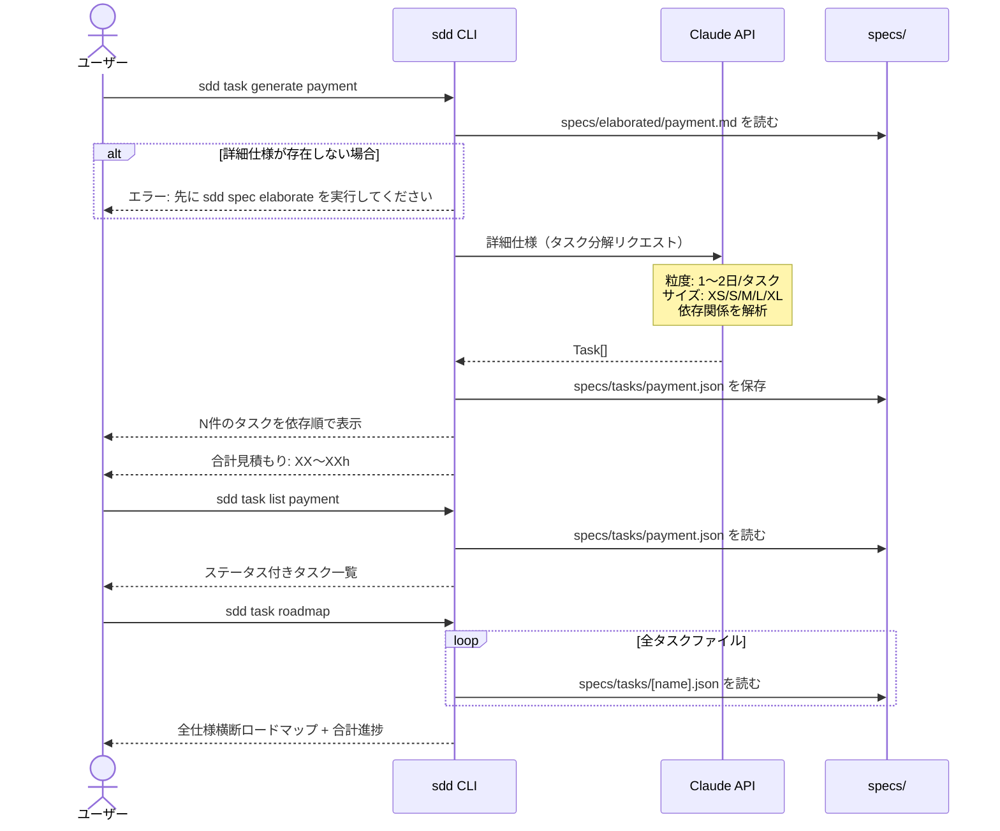
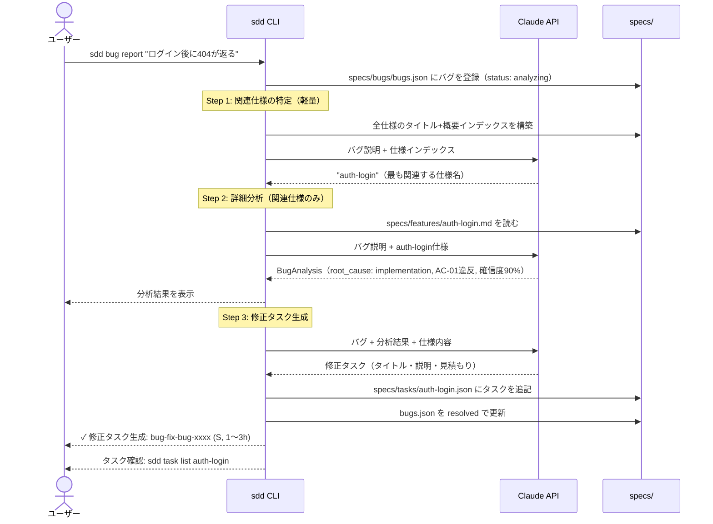
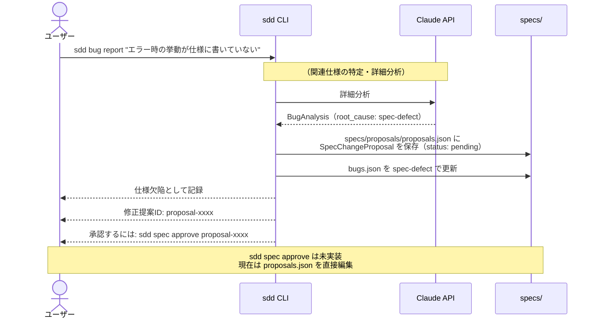
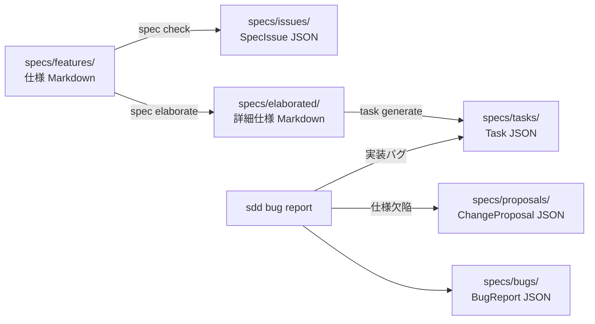

# シーケンス図

> `sdd` CLI v0.1.0 の各ユーザーストーリーのシーケンス図

---

## 全体フロー概要

---

## US-A01〜A03: 認証フロー

---

## US-S01: 仕様のdraft生成

---

## US-S02〜S03: 仕様校正・指摘解決

---

## US-S05〜S07: 詳細仕様生成

---

## US-T01〜T03: タスク管理

---

## US-B01〜B03: バグ報告（実装バグの場合）

---

## US-B03: バグ報告（仕様欠陥の場合）

---

## データフロー（ファイルシステム）

