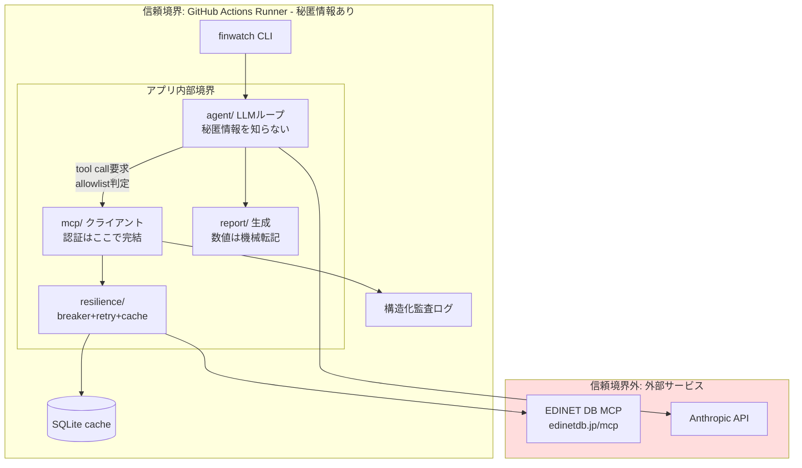

# アーキテクチャ(C4 + 信頼境界)

## C2: Container図

## データフロー上の要点

1. **ツール結果は不信頼入力**: EDBからの全レスポンスはzodパース→正規化→「データ」としてラップしてLLMへ(threat-model参照)
2. **認証の一方向性**: 認証情報は `mcp/transport` から外に出ない。agent層のインターフェースに認証の概念がない
3. **数値の経路分離**: レポートの数値はツール結果→report層へ直接渡す。LLM経由の数値転記を禁止(幻覚対策)

## Production構成(設計のみ、未実装)

商用化する場合の移行パス: GitHub Actions → EventBridge + Lambda、GitHub Secrets → Secrets Manager(自動ローテーション)、SQLite → DynamoDB(TTL属性)、Issue起票 → CloudWatch Alarm + PagerDuty。アプリ層(agent/mcp/resilience)はインフラ非依存に設計してあり変更不要。
