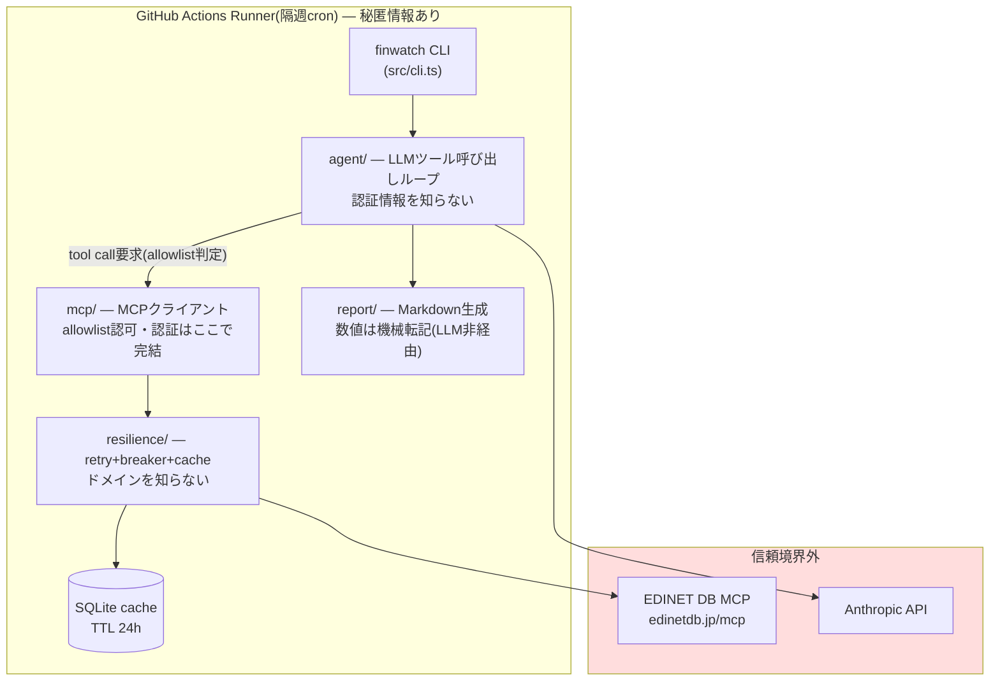

# finwatch 全体構成 — 概要

> 詳細は各リンク先が正。本資料は入口となる1枚概要(詳細版: `docs/architecture/c4.md`)

## 一言でいうと

建材業界の上場競合4社(三協立山・LIXIL・三和HD・不二サッシ)の財務データを、外部公開MCPサーバー **EDINET DB** から取得し、隔週の競合モニタリングレポートを自動生成するCLIエージェント。**MCPホスト(クライアント)を自前実装**し、エンタープライズグレードの非機能設計(認可・回復性・テスト自動化・コスト管理)を実証することが目的。

## 全体像

## レイヤー構成と責務

| レイヤー | 責務 | 知らないこと | 状態 |
|---|---|---|---|
| `src/resilience/` | retry(指数バックオフ+jitter) / CircuitBreaker(5失敗→open, 60s→half-open) / SQLiteキャッシュ / これらを合成したパイプライン | MCP・LLM・ドメイン | ✅ 実装済(Phase 1) |
| `src/mcp/` | MCPクライアント(Streamable HTTP transport, セッション, tool registry)、allowlist認可、redact | LLM | 一部実装(allowlist/redact) |
| `src/agent/` | Anthropic APIのtool useループ、トークン予算ガード | MCPの詳細・認証情報 | 未実装(Phase 3) |
| `src/report/` | Markdownレポート生成。純関数中心 | 外部API | 未実装(Phase 3) |
| `evals/` | LLMのツール選択精度の測定(閾値90%、CIゲート) | — | ケース1件のみ(Phase 4) |

## 設計上の3つの分離(これが本プロジェクトの核)

1. **認証の秘匿境界** — APIキーは `mcp/transport` 内で完結し、LLMに触れる `agent/` 層は認証の存在すら知らない。境界がモジュール境界と一致するためレビューで機械的に検証できる(ADR-0005)
2. **ツール実行のfail-closed認可** — `config/tool-allowlist.json` のread-onlyツールのみ実行可。prompt injectionやサーバー側のツール追加(rug pull)に構造的に耐える(ADR-0006)
3. **数値の経路分離** — レポートの数値はツール結果→report層へ直接転記し、LLMは解説文のみ担当。幻覚が数値に混入する経路を塞ぐ(architecture/c4.md)

## 回復性(ADR-0007)

全MCP呼び出しは `cache → retry → circuit breaker` のパイプライン経由:

- TTL(24h)内キャッシュヒット → 外部を呼ばない(レート制限100req/日対策+コスト削減)
- 429検知 → リトライせずTTL無視でキャッシュ優先に即切替
- 障害(リトライ枯渇・breaker open) → staleキャッシュでレポート生成を続行し、**鮮度をレポートに必ず明示**(silent staleness禁止)

## ドキュメント地図

| 資料 | 内容 |
|---|---|
| `docs/adr/0001〜0010` | 全設計判断(検討した選択肢・却下理由・トレードオフ) |
| `docs/threat-model/stride.md` | LLM+MCP特有の脅威モデル(prompt injection、rug pull等) |
| `docs/slo/slo.md` | SLI/SLO(生成成功率99%・鮮度72h/95%・完全性90%・eval 90%)とエラーバジェット |
| `docs/test-strategy.md` | 3層テスト(L1 unit / L2 contract / L3 eval)の設計 |
| `docs/architecture/c4.md` | C4モデル+信頼境界図+Production移行パス |
| `docs/implementation-plan.md` | Phase 0〜5の実装計画(進捗は `docs/workflow.md` 参照) |
| `docs/runbook.md` | キーローテーション・障害対応・SLOレビュー手順 |

## 技術スタック

Node.js 22 / TypeScript strict(ESM) / `@modelcontextprotocol/sdk` / `@anthropic-ai/sdk` / better-sqlite3 / zod / vitest / eslint + prettier。変更はADR経由のみ(CLAUDE.md)。
