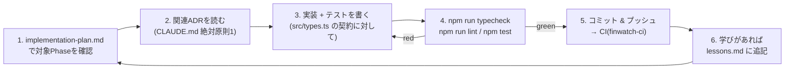
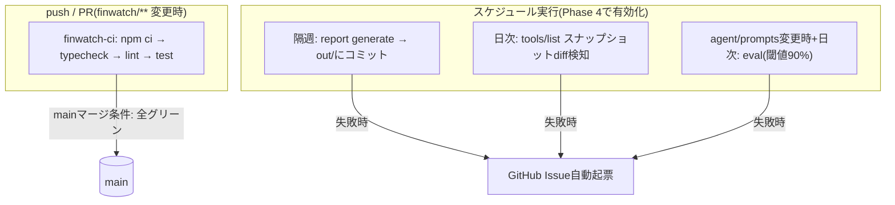

# 作業の流れ — 開発ワークフローと進捗

## 進捗サマリー(2026-07-02時点)

| Phase | 内容 | 状態 |
|---|---|---|
| 0 | 足場(tsconfig/eslint/vitest/config雛形/CI) | ✅ 完了 |
| 1 | resilience層(retry/breaker/cache/redact/allowlist) — L1テスト47件 | ✅ 完了 |
| 2 | MCPクライアント層(Streamable HTTP接続、スナップショット、契約テスト) | ⬜ 次 |
| 3 | agent + report層(tool useループ、予算ガード、レポート生成) | ⬜ |
| 4 | eval + 運用ワークフロー(evalランナー、Actions cron、Issue自動起票) | ⬜ |
| 5 | (任意)磨き込み | ⬜ |

各Phaseの完了条件と成果物の定義は `docs/implementation-plan.md` が正。

## Phase単位の作業サイクル



**守るべきルール(CLAUDE.mdより)**

- Phase順厳守。Phaseを跨いだ先回り実装をしない
- ADRに反する実装をしない。変更したければ先にADRを更新(superseded)
- 完了条件は常に「そのPhaseのテストがグリーン + typecheck パス」
- 秘匿情報はコード・ログ・fixtureに書かない。ログは `redact()` 経由

## 日常の開発コマンド

```bash
cd finwatch
npm install            # 初回のみ
npm run typecheck      # tsc --noEmit
npm run lint           # eslint(strictTypeChecked + prettier)
npm test               # L1 unit + L2 contract(決定的、<10s)
npm run eval           # L3 eval(APIコスト発生。明示的にのみ実行)
```

## CI / 自動化の流れ



- **有効なCI**: リポジトリルートの `.github/workflows/finwatch-ci.yml`(`finwatch/**` 変更時のみ発火)
- `finwatch/.github/workflows/biweekly-report.yml` は意図的に休眠中(report生成が未実装のため)。Phase 4でルートへ移動して有効化

## テストの3層(どこに何を書くか)

| 層 | 場所 | 対象 | いつ実行 |
|---|---|---|---|
| L1 unit | `tests/unit/` | resilience・redact・allowlist・report純関数・budget計算 | 毎push(決定的) |
| L2 contract | `tests/contract/` | MCPクライアント⇔モックサーバー(スナップショット生成)、エラー系(429/500/timeout) | 毎push(決定的) |
| L3 eval | `evals/cases/` | LLMのツール選択・引数生成の精度(k=3試行、閾値90%) | prompts変更時+日次(コスト発生) |

本番で発見した誤動作は必ず `evals/cases/` に追加する(リグレッション資産化、test-strategy.md)。

## 運用フロー(Phase 4以降)

1. **隔週レポート生成**(第1・第3木曜): Actions cron → 失敗時はIssue自動起票
2. **障害対応**: Issueを見てActionsログ確認 → 外部起因(429/5xx)ならstaleレポートが出ているか確認(出ていれば鮮度SLI消費として記録、出ていなければresilience層のバグ) — 手順は `docs/runbook.md`
3. **スキーマdiff検知**: allowlist該当ツールの変更を確認 → zodスキーマ修正PR → スナップショット更新
4. **四半期**: APIキーローテーション、SLO実績レビュー(`docs/slo/slo.md` に追記)
